# 프로잭트명: 불이야🔥
 센서가 포함된 화재감지기에 카메라를 추가하여 정확한 화재감시를 목적으로 하여 불필요한 인력 낭비를 방지하고 화재 피해를 감소시키는 스마트 화재 감지∙예방 시스템을 목표로 한다. 화재가 발생했을 때 인근의 소방서에 알림을 보내고, 사용자가 단말기로 시간과 장소에 상관없이 화재 알림 서비스를 받아 신속히 상황을 파악하고 대피할 수 있도록 돕는다. 이를 통해 재산·인명 피해를 최소화하고 대형화재로 번질 수 있는 위험을 사전에 차단한다.

## 📖 프로젝트 계요

- 프로젝트 소개
  >- 센서가 포함된 화재감지기에 카메라를 추가하여 정확한 화재감시
  >- 1~3단계별로 앱을 통하여 이용자에게 알람이 가며 3단계 달성시 119에 바로 신고
  >- 앱을 통하여 실시간으로 센서값과 CCTV화면을 확인가능

 

- 프로젝트 계획이유
  >
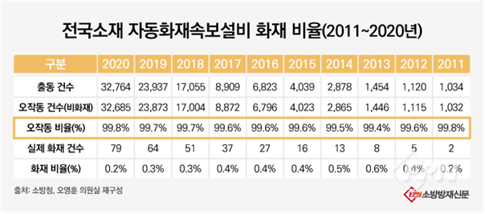
   
  >자동 화재 감지설비로 인한 출동 건수는 2011년 기준 1,034건 2020년 기준 32,685건으로 10년 동안 216% 늘었다. 그만큼 자동 화재 감지설비의 보급률이 늘었다고 볼 수 있지만, 이중 실제 화재는 10년 동안 변함없이 1% 미만을 기록하고 있다. 이러한 설비의 오작동은 소방서의 잘못된 출동으로 인한 공공 행정력 낭비 뿐만 아니라 신뢰성 상실로 인한 안전 불감증으로도 이루어진다. 2017년부터 2021년까지 3년간 각 자동 화재 감지 설비 오작동 발생비율은 불꽃 감지기의 경우 발생비율이 41.3%로 가장 높았으며, 그 다음으로 정온식 감지기 6.9%, 차등식 감지기 4.02%, 광전식 감지기 3.94%의 발생비율을 보였다. 감지기들의 오작동 원인은 습기로 인한 기기 전기적 오류, 기기 노후화, 먼지 등이 원인으로 뽑고 있다. 

 

- 프로젝트 목표
  >- 이를 해결하기 위해서 센서를 하나만 사용하여 화재를 판단하는 기존 제품들의 틀을 벗어나 불꽃 감지 센서, CO 센서, 가스 농도 센서 등 다양한 센서들과 CCTV의 영상까지 활용할 수 있는 복합적으로 판단하는 시스템을 설계
  > - 각종 센서 데이터를 수집하여 복합적으로 판단하고 CCTV 영상을 딥러닝으로 분석하여 두 개의 정보를 사용해 더 정확한 화재 알림을 제공
  > - 화재가 발생하면 규모에 따른 화재등급을 나누어 사용자에게 스마트폰 앱을 통해 1단계부터 3단계까지 알림을 보내고, 요청 시 실시간으로 CCTV 화면을 확인할 수 있으며 3단계 화재 발생 시, 초기에 화재를 진압할 수 있도록 즉시 119에 신고

## 📌 주요 기능

- 센서가 포함된 화재감지기에 카메라를 추가하여 정확한 화재감시
- 1~3단계별로 앱을 통하여 이용자에게 알람이 가며 3단계 달성시 119에 바로 신고
- 앱을 통하여 실시간으로 센서값과 CCTV화면을 확인가능

## 🕰 개발 기간 및 일정

> 2022.03 – 2022.12
>
> 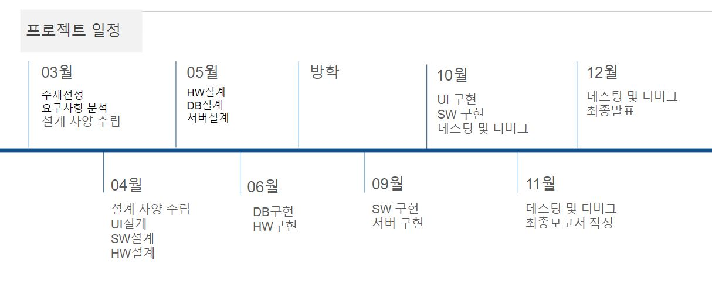

## 🤝 멤버 구성

- 류형환(팀장) - 일정 조율, 기능 구현 역할 분담, 통합 시스템 관리, 문서작성, 전반적인 프로젝트 관리
- 김건우 - 하드웨어 설계, 백엔드 개발(파이썬 Flask 프레임워크, Yolo v5), 문서 작성
- 김무성 - UI 설계(App 제작), DB 설계 및 구현, 데이터 수집, 문서 작성, 기능 구현
- 권민혁 - 데이터 수집및 Training(Yolo v5), 문서 작성, 기능 구현
- 서준 - UI 설계(App 제작), DB 설계 및 구현, 데이터 수집, 문서 작성, 기능 구현

## ⚙ 기술 스택
 

 

## 적용기술

|적용기술|적용|
|:---:|:---:|
||오감지를 줄이기 위해 가장 최신 버전인 YOLO v5 알고리즘을 사용하고, 최대한 여러 사진을 모아 데이터 세트를 만든다. 다만 해당 알고리즘의 특성상 GPU 활용도가 높아 컴퓨팅 성능에 알맞은 모델을 사용한다.  학습모델 : yolov5l, epoch : 300 batch size : 2 학습데이터 : 507, 테스트데이터 : 200    결과    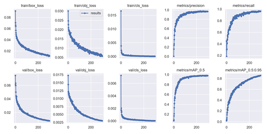|
||Yolov5와 OpenCV를 통해 얻어진 영상을 실시간으로 앱으로 전송한다.|
||Open CV를 이용하여 영상처리, 실시간 영상 전송 등 다양한 라이브러리를 사용한다.|

## 아키텍처
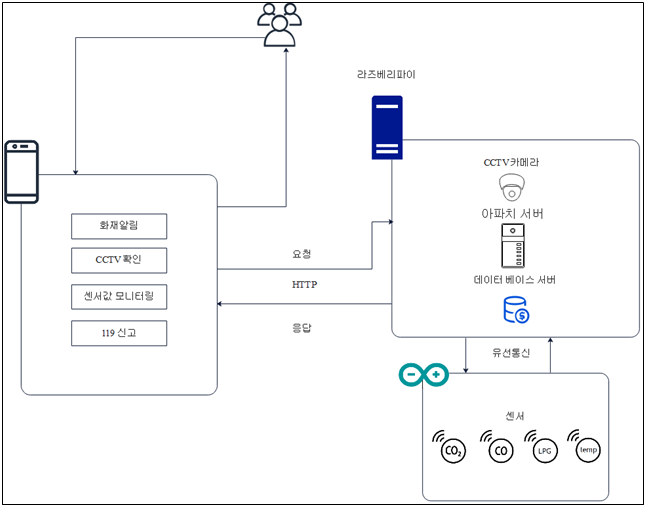

## 시스템
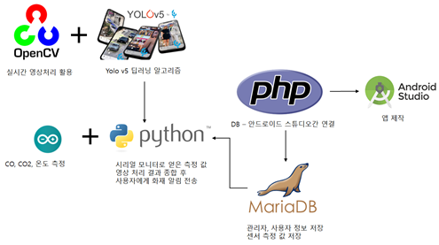

## 하드웨어
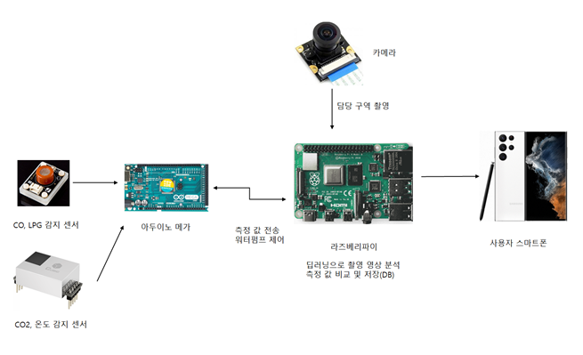 
Co, Co2, LPG, 온도감지센서는 아두이노 메가에서 센서 값을 받아 라즈베리 파이의 데이터베이스에 저장한다. 그리고 실시간으로 카메라를 이용하여 현장을 감시한다. 만약 화재가 감지되면 화재 발생 시간을 데이터베이스에 저장한다 그리고 사용자의 휴대전화에 알림을 가한다.

## 🛢데이터베이스 설계

||
|---|
|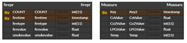|
|CCTV 영상에서 화재를 발견하면 바운더리 박스를 치면서 firepr에 시간과 화재 발생을 데이터베이스에 저장을 하고 Measure에서는 1초마다 센서에서 수집한 Co, Co2, LPG, 온도값을 데이터 베이스에 저장한다.|

## 클래스 다이어그램

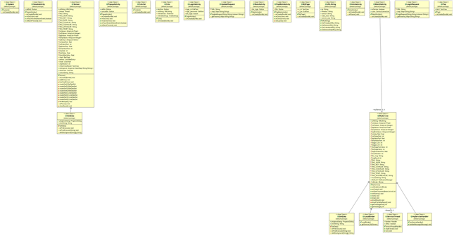

## 구현된 시스템 개요

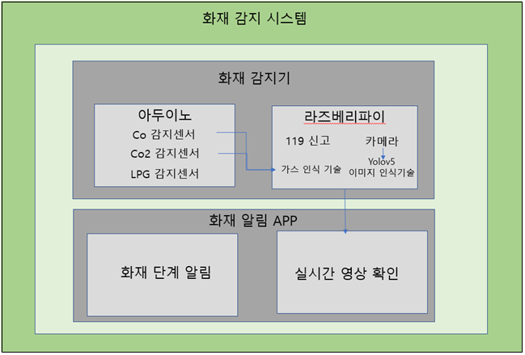

### 서버 사양

Raspberry Pi 4 Model B
운영체제로는 Debian Bullseye 기반인 라즈베리파이 OS 11 64비트를 이용한다.
무거운 작업이 많아 CPU는 기존의 1.5Ghz 에서 1.8Ghz로, GPU는 500Mhz에서 600Mhz 로 오버클럭을 하였고, 추가적인 쿨링팬 장착과 방열판을 추가했다. 저장장치는 외장 SSD를 사용하여 더욱 빠른 속도로 처리가 가능하게 하였다.

### 서버 기본 환경 구성

방화벽 구성
ufw 패키지를 설치하고, 기본으로 설정된 포트로 접근하는 무차별적인 공격을 방지하기 위해 해당 서비스들의 포트(SSH, MariaDB, VNC 등)를 변경한 뒤 ufw에서 해당 포트의 접속을 허가한다. (기본값으로 허가한 포트를 제외하고 나머지 포트들은 접근이 불가능하다.)

### VNC
장소 특성상 모니터 연결 없이 사용하는 경우가 많아 외부에서 접근할 수 있게끔 VNC 기능을 활성화했고, 계정을 등록해 공장 안이 아니라 외부에서도 접근할 수 있게 설정했다.

### SSH
기본적인 설정을 위해 원격 접속을 설정하고, VNC로 인한 접근이 불가능할 시 2차적인 수단으로 작업하기 위해 사용한다.

### APM(Apache, PHP, MariaDB) 설치
PHP와 웹서버를 사용하기 위한 APM 패키지를 설치하고, 기본적인 설정(외부 접근 설정) 을 진행하였다.

 

## 요구사항 명새서

### 기능요구사항

> |요구사항 분류||기능|
> |:------:|:---:|:---|
> |요구사항 번호||FUN-001|
> |요구사항 명칭||이산화탄소 감지 기능|
> |요구사항 상세 설명|정의|기능|
> ||세부 내용|이산화탄소 센서로 이산화탄소를 측정한다.|
> |산출정보||기능목록|
> |관련요구사항||

> |요구사항 분류||기능|
> |:------:|:---:|:---|
> |요구사항 번호||FUN-002|
> |요구사항 명칭||일산화탄소 감지 기능|
> |요구사항 상세 설명|정의|기능|
> ||세부 내용|일산화탄소 감지 센서로 일산화탄소를 감지한다.|
> |산출정보||기능목록|
> |관련요구사항||

> |요구사항 분류||기능|
> |:------:|:---:|:---|
> |요구사항 번호||FUN-003|
> |요구사항 명칭||영상 촬영 기능|
> |요구사항 상세 설명|정의|기능|
> ||세부 내용|해당 구역의 영상을 촬영한다.|
> |산출정보||기능목록|
> |관련요구사항||

> |요구사항 분류||기능|
> |:------:|:---:|:---|
> |요구사항 번호||FUN-004|
> |요구사항 명칭||실시간 영상 전송|
> |요구사항 상세 설명|정의|기능|
> ||세부 내용|사용자가 요청 시 실시간으로 CCTV 영상을 볼 수 있게 한다.|
> |산출정보||기능목록|
> |관련요구사항||

> |요구사항 분류||기능|
> |:------:|:---:|:---|
> |요구사항 번호||FUN-005|
> |요구사항 명칭||119 신고 기능|
> |요구사항 상세 설명|정의|기능|
> ||세부 내용|화재 3단계 발생 시 119에 문자메시지로 신고한다. 화재 발생 위치, 발생 시간 전송|
> |산출정보||기능목록|
> |관련요구사항||

> |요구사항 분류||기능|
> |:------:|:---:|:---|
> |요구사항 번호||FUN-006|
> |요구사항 명칭||데이터 시각화|
> |요구사항 상세 설명|정의|기능|
> ||세부 내용|아두이노에서 받아온 측정값을 받아와 App 내에서 그래프로 표현한다.|
> |산출정보||기능목록|
> |관련요구사항||

> |요구사항 분류||기능|
> |:------:|:---:|:---|
> |요구사항 번호||FUN-007|
> |요구사항 명칭||화재알림|
> |요구사항 상세 설명|정의|기능|
> ||세부 내용|화재 발생 시 등급마다 화재 알림을 Notification Bar에 표시한다.|
> |산출정보||기능목록|
> |관련요구사항||

### 제약사항

> |요구사항 분류||기능|
> |:------:|:---:|:---|
> |요구사항 번호||COR-001|
> |요구사항 명칭||성능 제약사항|
> |요구사항 상세 설명|정의|성능 제약|
> ||세부 내용|기온이 50도 이상인 환경에서 사용 불가.|
> |산출정보||기능목록|
> |관련요구사항||

### 성능 요구사항

> |요구사항 분류||성능 요구사항|
> |:------:|:---:|:---|
> |요구사항 번호||PER-001|
> |요구사항 명칭||불꽃 감지 센서 인식 속도|
> |요구사항 상세 설명|정의|불꽃을 감지하는 센서의 인식 속도|
> ||세부 내용|화재 발생 시 10초 이내에 인식하도록 한다.|
> |산출정보||
> |관련요구사항||

> |요구사항 분류||성능 요구사항|
> |:------:|:---:|:---|
> |요구사항 번호||PER-002|
> |요구사항 명칭||CO 센서 인식 속도|
> |요구사항 상세 설명|정의|CO를 감지하는 센서의 인식 속도|
> ||세부 내용|CO 발생 시 30초 이내에 인식하도록 한다.|
> |산출정보||
> |관련요구사항||

> |요구사항 분류||성능 요구사항|
> |:------:|:---:|:---|
> |요구사항 번호||PER-003|
> |요구사항 명칭||CO2 센서 인식 속도|
> |요구사항 상세 설명|정의|CO2를 감지하는 센서의 인식 속도|
> |요구사항 상세 설명|세부 내용|CO2 발생 시 30초 이내에 인식하도록 한다.|
> |산출정보||
> |관련요구사항||

### 품질 요구사항

> |요구사항 분류||품질 요구사항|
> |:------:|:---:|:---|
> |요구사항 번호||QUR-001|
> |요구사항 명칭||시스템 신뢰성|
> |요구사항 상세 설명|정의|주어진 환경에서 문제없이 성능을 유지할 수 있는 척도|
> ||세부 내용|24시간 CCTV 화면을 제공하여 지속적인 운영 가능 보장  요구된 기능을 오류 없이 규정된 성능 수준을 유지할 수 있는 능력|
> |산출정보||
> |관련요구사항||

### 인터페이스 요구사항

> |요구사항 분류||인터페이스|
> |:------:|:---:|:---|
> |요구사항 번호||INR-001|
> |요구사항 명칭||통합UI|
> |요구사항 상세 설명|정의|통합UI 개념 정의|
> ||세부 내용|주 사용자층을 타깃으로 앱 UI를 설계한다.  글자 폰트, 크기, 화면 구성을 일관성 있게 통일한다.|
> |산출정보||사용자 인터페이스 설계서|
> |관련요구사항||

> |요구사항 분류||인터페이스|
> |:------:|:---:|:---|
> |요구사항 번호||INR-002|
> |요구사항 명칭||통합UI|
> |요구사항 상세 설명|정의|통합UI 개념 정의|
> ||세부 내용|사용자가 쉽고 간편하게 사용할 수 있는 직관적인 화면 제공|
> |산출정보||사용자 인터페이스 설계서|
> |관련요구사항||

### 테스트 요구사항

> |요구사항 분류||테스트 요구사항|
> |:------:|:---:|:---|
> |요구사항 번호||TER-001|
> |요구사항 명칭||테스트|
> |요구사항 상세 설명|정의|테스트 개념 정의|
> ||세부 내용|시스템시험의 범위, 수행 절차, 조직, 일정, 시험환경 및 평가 기준을 구체적으로 수립하여 시나리오별 점검되어야 함 테스트 시나리오에 따라 테스트가 완료된 프로그램들을 대상으로 다음 사항을 검증하여야 함 기능 및 성능 등의 요구사항 및 설계 사양 충족 여부 검증 시스템의 접근권한 및 업무 권한에 대한 적절성 검증 결함을 파악하고 원인을 추적하여 결함을 제거하여야 함|
> |산출정보||통합 테스트 결과서|
> |관련요구사항||

## 🖥 시제품 및 화면구현

### 시제품

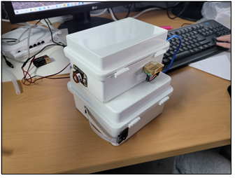

### APP 실행 화면

||화재 단계별 메인화면||
|:---:|:---:|:---:|
| 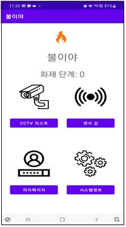  |  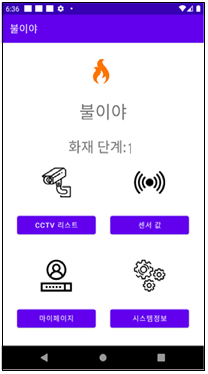 |   |

 

||CCTV 리스트를 터치했을 때||
|:---:|:---:|:---:|
| 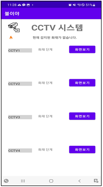  |    |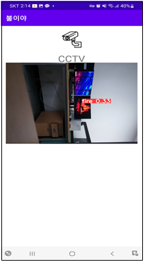 |
|CCTV화면을 터치시 나오는 화면.  CCTV 리스트가 있는 화면이 출력된다.||화면보기 터치시 보이는 화면.  CCTV를 앱을 통하여 볼 수 있으며 화재영상이 찍히면  바운더리 박스를 치면서 불이라 알려주며 위치를 알려준다.|

 

||센서값을 터치했을 때||
|:---:|:---:|:---:|
| 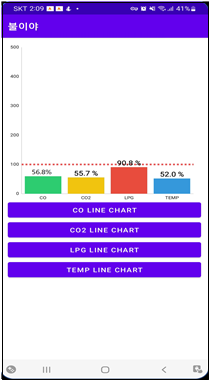  ||  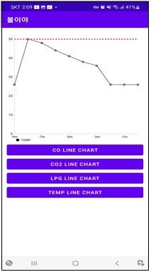   |
|센서값을 터치했을때 화면 센서별 기준치  대비 비율을 1초마다 갱신하여 보여준다 ||차트 아래에 있는 버튼을 터치하였을때 나오는  화면 최근 10분간의 데이터를 1분간격으로 보여준다|

 

||화재 단계별 메인화면||
|:---:|:---:|:---:|
| 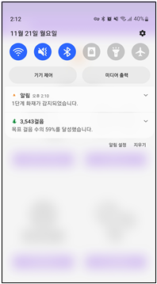  |  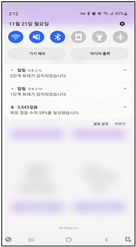 |  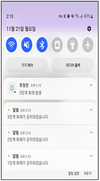 |
|1단계 화재가 발생했을 때  1단계 알림을 울린다|2단계 화재가 발생했을 때  2단계 알림을 울린다|3단계 화재가 발생 했을 때  3단계 알림을 울린다|

## 기대효과
화재 발생 시 즉각적인 대처가 가능해지며 오작동으로 인한 불필요한 출동이 줄여 낭비되는 인력과 예산을 감소시킬 수 있을 것으로 기대한다. 화재가 발생하기 전에 위험요인을 감지하여 예방하는 것으로 화재로 인한 인명 피해, 재산 피해를 줄이는 효과가 있을 것이다.

## 💡 개발 중 장애 및 극복 방법

 ### 프로젝트의 완성이 얼마 남지 않은 시기에 영상 인식이 안 되는 문제가 발생
라즈베리파이 OS 가 업데이트 되면서 기존의 레거시 스택인 raspicam 대신 libcamera를 사용하게 되었는데, 이 경우 우리가 사용할 yolov5와 호환이 되지 않아 카메라 인식이 불가능하여 불꽃 감지를 수행할 수 없다.

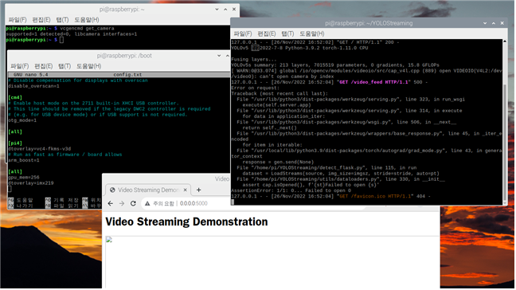

이 문제를 해결하기 위해 raspi-config 파일에 dtoverlay=imx219 구문을 주석처리하게 되면 기존의 레거시 스택으로 변경되며, YOLO v5 상에서 카메라 인식이 가능해진다.

### YOLO v5 Fusing layers 뜬 후 진행 불가 문제

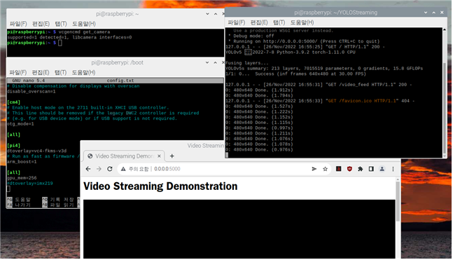
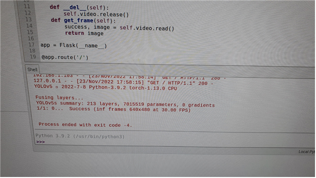

파이썬 패키지 중 torchvision과 torch의 호환성의 문제 윈도우 기반 PC  에서는 최신버전의 torch와 torchvision을 사용해도 아무런 문제가 없었으나, 리눅스 기반 라즈베리파이에선 문제가 발생했다. 이후 최신버전의 torch와 torchvision을 제거하고, torch는 1.11.0, torchvision은 0.12.0 버전으로 다운그레이드 진행 후에 정상적으로 판별이 가능한 것을 확인 하였다.

### 앱이 재대로 실행되지 않는 문제 발생

프로젝트 최종 발표 2시간 전 앱을 실행하였을 때 CCTV 화면이 제대로 나오지 않는 문제가 발생하였다. 확인을 하여보니 휴대폰이 너무 최신 모델이어서 우리가 개발한 앱과 호환이 되지 않아 발생한 문제였다. 그래서 전 모델을 사용하여 다행히 발표를 잘 마무리할 수 있었다.
## 💡추가 및 리서치 하고 싶은 기능

1. 인식률 향상
    현재는 데이터 확보의 부족으로 학습이 부족하여 카메라의 연기 인식이 너무 안 좋아 불꽃만 가지고 화재를 판단하고 있지만, 더욱 많은 데이터를 학습시켜 연기도 추가하고 불꽃의 인식률도 높여 더욱 정확한 화재감지기를 만들고 싶습니다.
    
2. 화재 예방  
    화재가 발생하기 전에 습도나 계절 등 주변 환경과 실내 위험요인을 감지하여 화재를 미리 방지하고 예방하는 시스템으로 발전해 나가고 싶습니다.

3. 화재 초동 조치시스템 추가 
    현재는 단순히 화재 발생의 여부와 신고기능만 가지고 있지만, 사용자가 확인하여 원격으로 화재를 진압할 수 있게 하거나 3단계가 발생하면 자동으로 화재진압 할 수 있는 기능을 추가하고 싶습니다.
    

 ## 💡 후기

- 류형환
  >캡스톤 디자인 조장을 맡으면서 많은 것을 배우게 된 거 같다. 팀 프로젝트를 하면서 팀원들과의 의견조율이나 시간일정 역할 분배 등 많은 일을 하면서 팀원들과의 의사소통이 얼마나 중요한지를 깨닫게 되었다. 부족한 팀장이였던 것 같지만 끝까지 따라와 준 팀원들이 정말 고맙고 지금까지 한 번도 안 싸우고 잘 마무리 하게 돼서 다행인 것 같다. 

- 김건우
  >캡스톤 II 교과목을 계절학기로 수강해버린 뒤라 나머지 팀원들과의 시간 조율이 어려웠다. 조율 끝에 11월 23일에 만나자고 하고 그전까지 카톡으로 여러 방안을 팀원들과 공유했으나 해결하지 못하였다. 23일 당일. 학교에서 팀원들을 만나 장장 7시간 만에 관련 문제를 해결했는데, 해결하고 나니 왜 이걸 지금까지 못 찾았지 하는 생각이 들 정도로 너무 허무하기도 했고, 마감일 전에 해결되어 다행이라는 생각이 들었다. 

- 김무성
  >캡스톤 디자인 프로젝트에서 DB에 저장된 센서 데이터를 모바일 애플리케이션으로 전송하여 사용자에게 결과를 어떻게 보여줄 것인지에 대한 기능 구현을 주로 진행했다. 교수님과 팀원들의 의견을 통해서 새로운 해결법을 찾고 기한 내에 구현할 수 있었다. 안드로이드 개발을 처음 접하고 적응하는데 캡스톤 I에서 많은 시간을 소모했다. 테스트에서 버전 호환 문제가 발생했었는데 API 버전에 따라 코드를 다르게 작성해야 한다는 것을 알게 됐다. 

- 권민혁
  >이전까지는 단순히 전공공부만 하였지만 캡스톤 디자인을 하며 팀원들과 함께 모여 아이디어를 구상하고 부족한 점이 많았지만, 담당교수님의 피드백과 어려운 부분은 지도교수님의 코멘트를 받음으로써 조금씩 완성되어가는 모습을 보면서 뿌듯했고 여러 가지 분야의 기술이 병합되어 하나로 어우러져 전공이해도와 실무능력을 향상하는 좋은 계기가 된 거 같다.

- 서준
  >캡스톤 교과목을 수강하면서 그전까지 실제로 딥러닝이라는 개념을 이론상으로 배우기만 했지만 실제로 데이터를 수집하고 Python을 이용하여 라벨링을 하고 yolov5를 통해서 학습을 시키는 과정에서 python 구문들을 공부할 수 있었고, 좋은 경험을 한 것 같습니다. 막바지에 Pytorch의 호환문제로 어려움이 있었지만 끝까지 프로젝트에 열심히 참여해준 팀원들 덕에 잘 마무리 할 수 있었던 것 같습니다.

